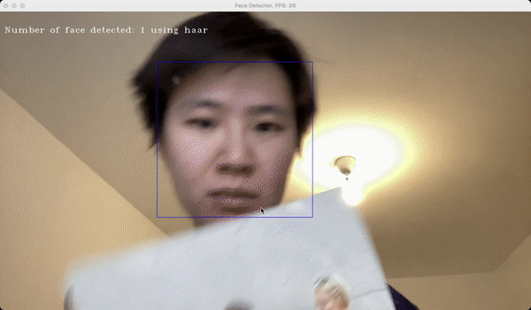

# Face-Detection

This project use OpenCV to detect human faces in real-time.

Two options available:

## Running options

`dnn` or `haar` are the two methods that can be used to detect faces. They are passed as command line arguments.

Namely, `./face_detection dnn` or `./face_detection haar`.

## Rubric

The project bellows to the first option of the capstone project.

| Criteria (README)                                                  | Met? |
|--------------------------------------------------------------------|------|
| A README with instructions is included with the project            | ✅    |
| The README indicates which project is chosen.                      | ✅    |
| The README includes information about each rubric point addressed. | ✅    |

| Criteria (Compiling and Testing)     | Met? |
|--------------------------------------|------|
| The submission must compile and run. | ✅    |

| Criteria (General Topics)   | Met? |
|-----------------------------|------|
| Loops, Functions, I/O       | ✅    |
| Object Oriented Programming | ✅    |
| Memory Management           | ✅    |
| Concurrency                 | ✅    |